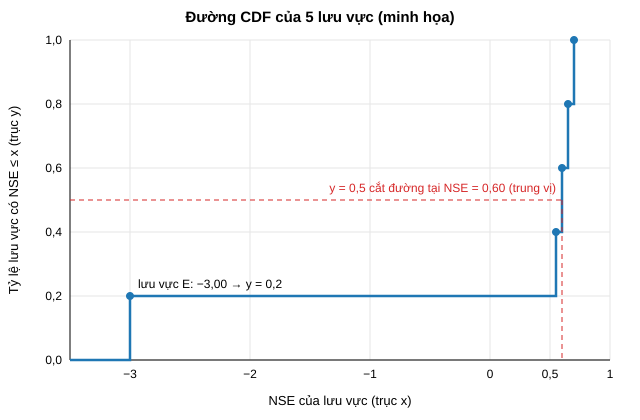
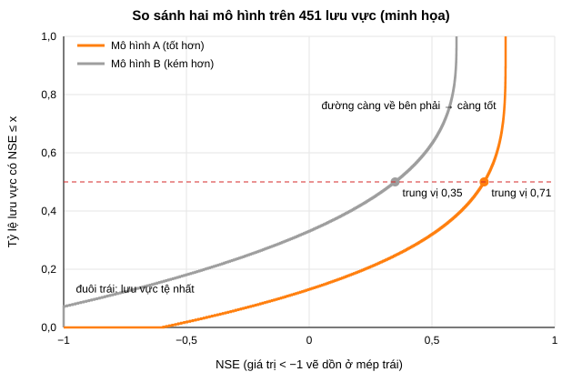
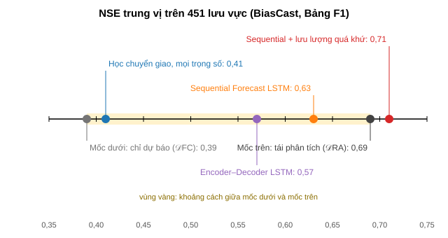
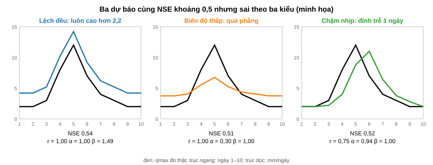
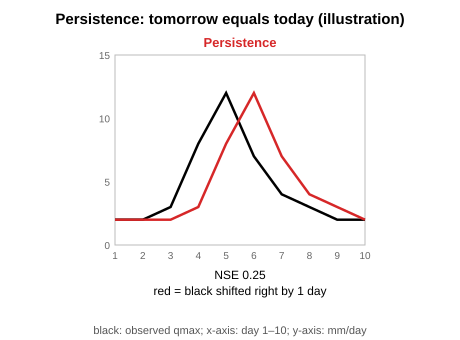

# BiasCast — Phần 2: Đo chất lượng dự báo

Phần 2 của ghi chú học BiasCast (Phần 1: `03_BiasCast1_Overview.md`). Ký hiệu nguồn giữ như Phần 1:

- **[Bài]**: bản chữ `PaperResearch/PaperResearchPDF/BasePaper/Konold2026_HESS_BiasCast_FullText.md`, kèm số dòng.
- **[Mã]**: mã NeuralHydrology trong bản fork của tác giả, thư mục `PaperResearch/PaperResearchCode/BiasCast_NH/neuralhydrology/`, ghi tên tệp và số dòng.
- **[Cơ sở]**: `01_Plan/02_BasePaper.md`, kèm mục.

Nội dung Phần 2: chỉ số NSE; cách bài tổng hợp NSE của 451 lưu vực; mốc trên và mốc dưới; độ suy giảm khi đổi miền dữ liệu; chênh lệch NSE theo lưu vực; giới hạn của NSE và các chỉ số đề tài thêm (KGE, persistence và PNSE, kiểm định Wilcoxon). Mỗi mục có ví dụ số tự đặt, ghi rõ "minh họa".

---

### 2.1. NSE — chỉ số chính của bài

**Cần đo cái gì.** Với một lưu vực, kỳ test 2014–2017 cho hai chuỗi cùng độ dài: qmax đo thật mỗi ngày (o₁, o₂, …) và qmax mô hình dự báo (s₁, s₂, …), cùng đơn vị mm/ngày (Phần 1, Mục 1.4). Cần một con số cho biết hai chuỗi khớp nhau tới đâu. BiasCast chỉ dùng một chỉ số là NSE (Nash–Sutcliffe Efficiency; Nash và Sutcliffe, 1970): mọi hình kết quả của bài là đường phân phối NSE qua 451 lưu vực ([Bài] dòng 196).

**Công thức** ([Mã] `evaluation/metrics.py` dòng 52–92; [Bài] Phụ lục C, dòng 376–382, công thức C1):

NSE = 1 − Σ (sₜ − oₜ)² / Σ (oₜ − ō)²

| Ký hiệu | Nghĩa |
|---|---|
| oₜ | qmax đo thật ngày t |
| sₜ | qmax dự báo ngày t |
| ō | trung bình qmax đo thật trên cả kỳ đánh giá của lưu vực đó |
| Tử số Σ (sₜ − oₜ)² | tổng bình phương sai số của mô hình |
| Mẫu số Σ (oₜ − ō)² | tổng bình phương sai số của "mô hình" luôn đoán bằng ō — tức độ dao động của chính chuỗi đo |

Đọc theo kiểu so sánh: NSE cho biết mô hình giảm được bao nhiêu phần sai số so với cách đoán đơn giản nhất là luôn đoán bằng trung bình (Schaefli và Gupta, 2007, *Hydrological Processes* 21: 2075–2080).

| Giá trị | Nghĩa |
|---|---|
| NSE = 1 | khớp hoàn toàn (tử số bằng 0) |
| 0 < NSE < 1 | tốt hơn đoán bằng trung bình; NSE = 0,7 nghĩa là sai số bình phương chỉ còn 30% so với đoán bằng trung bình |
| NSE = 0 | ngang với luôn đoán bằng trung bình |
| NSE < 0 | kém hơn cả đoán bằng trung bình; không có cận dưới |

**Ví dụ tính tay (minh họa).** Một lưu vực, 5 ngày, qmax đo thật (mm/ngày): 2, 4, 10, 6, 3; trung bình ō = 25 / 5 = 5.

Mẫu số: (2 − 5)² + (4 − 5)² + (10 − 5)² + (6 − 5)² + (3 − 5)² = 9 + 1 + 25 + 1 + 4 = **40**.

| Ngày | 1 | 2 | 3 | 4 | 5 | Tử số | NSE |
|---|---|---|---|---|---|---|---|
| Đo thật | 2 | 4 | 10 | 6 | 3 | | |
| Mô hình A | 2,5 | 4 | 8 | 6,5 | 3 | 0,25 + 0 + 4 + 0,25 + 0 = 4,5 | 1 − 4,5/40 ≈ **0,89** |
| Luôn đoán 5 | 5 | 5 | 5 | 5 | 5 | 40 | 1 − 40/40 = **0** |
| Mô hình C: lấy số đo hôm trước — persistence, Mục 2.6 (ngày 1 coi hôm trước là 2) | 2 | 2 | 4 | 10 | 6 | 0 + 4 + 36 + 16 + 9 = 65 | 1 − 65/40 ≈ **−0,63** |

Rút ra từ ví dụ:

- **Sai số được bình phương nên ngày đỉnh chi phối.** Ở mô hình A, riêng ngày đỉnh (lệch 2) góp 4 trong tổng 4,5 của tử số. NSE vì vậy nhạy với đỉnh lũ — phù hợp với mục tiêu dự báo qmax, nhưng một vài ngày lũ lớn có thể quyết định NSE của cả lưu vực.
- **Trễ một ngày bị phạt nặng.** Mô hình C có hình dạng đúng nhưng chậm một ngày: đỉnh 10 xuất hiện ở ngày 4 thay vì ngày 3, hai lần lệch lớn (ngày 3 thiếu 6, ngày 4 thừa 4) làm NSE âm.
- **Đổi đơn vị không làm đổi NSE.** Nếu nhân cả số đo lẫn dự báo với cùng một hằng số dương a rồi cộng cùng hằng số b (như đổi mm/ngày sang m³/s của một lưu vực), tử số và mẫu số đều nhân a², tỉ số giữ nguyên. Vì vậy NSE tính trên mm/ngày hay m³/s cho cùng kết quả (Phần 1, Mục 1.4).

Phụ lục C của bài còn nêu NSE* (công thức C2, dòng 378). Đó là hàm mất mát dùng khi huấn luyện, không phải chỉ số báo cáo kết quả; học ở Phần 4.

**Mã tính NSE trong NeuralHydrology** ([Mã] `evaluation/metrics.py`):

- Trước khi tính, bỏ mọi ngày mà số đo hoặc dự báo là NaN (hàm `_mask_valid`, dòng 38–45) — ngày trạm thiếu số đo không được tính.
- Tử số `((sim - obs)**2).sum()`, mẫu số `((obs - obs.mean())**2).sum()`, kết quả `1 - tử số / mẫu số` (dòng 87–90).
- NSE tính riêng cho từng lưu vực trên kỳ được đánh giá; ō là trung bình của chính kỳ đó, không phải của kỳ train.
- Chú thích trong mã gọi NSE là "R-square between observed and simulated discharge" (dòng 55). Cần hiểu là hệ số xác định so với đường y = x, không phải bình phương hệ số tương quan Pearson: r² luôn từ 0 tới 1 và không phạt lệch đều, còn NSE có thể âm và phạt cả lệch đều. VD dự báo luôn bằng đúng hai lần số đo có r² = 1 nhưng NSE thấp.

**Giới hạn cần nhớ ngay từ đầu.** Mốc so sánh của NSE là "luôn đoán bằng trung bình", một mốc rất dễ vượt: với chuỗi có mùa rõ (tuyết tan mùa xuân, khô mùa thu), một mô hình chỉ biết mùa đã đạt NSE cao. Schaefli và Gupta (2007) dẫn ví dụ chỉ lấy trung bình nhiều năm của từng ngày trong năm đã cho NSE 0,85, và đề nghị mỗi nghiên cứu phải chọn và giải thích mốc so sánh phù hợp. BiasCast giải quyết bằng mốc trên và mốc dưới (Mục 2.3); đề tài thêm mốc persistence và PNSE (Mục 2.6).

**Câu hỏi tự kiểm tra:**

1. Chuỗi đo 1, 3, 5 (mm/ngày); dự báo 2, 3, 4. NSE bằng bao nhiêu?
2. Một mô hình có NSE = −0,2 ở lưu vực X. Nói bằng lời nghĩa là gì?
3. Vì sao lưu vực có một trận lũ rất lớn trong kỳ test thì NSE dễ bị kéo lên hoặc xuống mạnh?

### 2.2. Gộp 451 lưu vực: trung vị và đường CDF

**Bước 1 — sau khi test có gì.** NSE tính riêng cho từng lưu vực (Mục 2.1), nên kết quả của một mô hình là một danh sách 451 con số, mỗi số là NSE của một lưu vực. Giống bảng điểm của một lớp 451 học sinh, mỗi học sinh một điểm; điểm cao nhất là 1, không có điểm thấp nhất.

**Bước 2 — tóm tắt bằng một con số: trung bình hay trung vị.** Trung bình là cộng hết rồi chia; trung vị là sắp xếp rồi lấy giá trị đứng giữa. Ví dụ 5 lưu vực (minh họa):

| Lưu vực | A | B | C | D | E |
|---|---|---|---|---|---|
| NSE | 0,70 | 0,65 | 0,60 | 0,55 | −3,00 |

| Thống kê | Cách tính | Kết quả | Cảm nhận khi đọc |
|---|---|---|---|
| Trung bình | (0,70 + 0,65 + 0,60 + 0,55 − 3,00) / 5 | −0,10 | tưởng cả năm lưu vực đều tệ |
| Trung vị | sắp xếp −3,00; 0,55; **0,60**; 0,65; 0,70, lấy giá trị giữa | 0,60 | đúng với thực tế: bốn lưu vực khá, một lưu vực hỏng |

NSE không có cận dưới (một lưu vực có thể −3, −50, −100), nên chỉ một lưu vực hỏng cũng kéo trung bình sập. Vì vậy bài dùng **trung vị** làm con số chính ([Bài] dòng 196; Phụ lục F của bài báo cáo thêm trung bình, độ lệch chuẩn, phân vị).

**Bước 3 — xem thêm độ đều: độ lệch chuẩn.** Hai mô hình có thể cùng trung vị nhưng một mô hình đều ở mọi lưu vực, mô hình kia có vài lưu vực hỏng nặng. Độ lệch chuẩn đo mức tản ra của danh sách; càng lớn càng có nhiều lưu vực lệch xa. Ví dụ thật trong bài: thêm dự báo lưu trữ vào pha quá khứ của Sequential Forecast LSTM, trung vị gần như giữ nguyên (0,63 → 0,62) nhưng trung bình giảm từ 0,57 xuống 0,19 và độ lệch chuẩn tăng từ 0,52 lên 6,28, do xuất hiện nhiều lưu vực có NSE âm rất lớn ([Bài] dòng 256). Tác giả chưa tìm được lời giải thích chung; ở lưu vực 758 mô hình dự báo cao hơn thực đo suốt kỳ test, phù hợp với khả năng có lấy nước hoặc công trình giữ nước dù lưu vực đã được lọc là ít chịu tác động của con người. Kết luận: mô hình đó không ổn định dù trung vị trông vẫn ổn.

**Phân vị.** Phân vị 10 là giá trị mà 10% lưu vực có NSE thấp hơn, đại diện cho nhóm lưu vực khó; phân vị 90 đại diện cho nhóm dễ. VD thêm lưu lượng quá khứ vào Sequential Forecast LSTM nâng phân vị 10 từ 0,35 lên 0,42; phân vị 75 và 90 đạt 0,81 và 0,88 ([Bài] dòng 272).

**Bước 4 — vẽ cả danh sách: đường CDF.** CDF (hàm phân phối tích lũy) vẽ toàn bộ 451 giá trị lên một hình thay vì chỉ một con số:

| Trục | Là gì | Khoảng giá trị |
|---|---|---|
| x (ngang) | giá trị NSE | từ giá trị âm nhỏ nhất trong danh sách tới tối đa 1; hình thường cắt bớt phần quá âm |
| y (dọc) | tỷ lệ lưu vực có NSE nhỏ hơn hoặc bằng x | từ 0 tới 1 (0% tới 100% số lưu vực) |

Cách vẽ: sắp xếp NSE tăng dần; đi từ trái sang phải, mỗi lần gặp một lưu vực thì đường nhảy lên thêm 1/n (n là số lưu vực). Với 5 lưu vực ở trên, mỗi bước nhảy 1/5 = 0,2:

| x (NSE đã sắp xếp) | −3,00 | 0,55 | 0,60 | 0,65 | 0,70 |
|---|---|---|---|---|---|
| y (tỷ lệ lưu vực có NSE ≤ x) | 0,2 | 0,4 | 0,6 | 0,8 | 1,0 |

Đọc một điểm: (0,60; 0,6) nghĩa là 60% số lưu vực có NSE không quá 0,60.

Với 451 lưu vực, mỗi bước nhảy chỉ 1/451 nên đường trông gần như trơn. Hình dưới so hai mô hình tự đặt (minh họa, không phải số của bài):

Cách đọc:

- **Trung vị** là chỗ đường cắt y = 0,5 (đường đỏ đứt): mô hình A 0,71, mô hình B 0,35.
- **Đường càng nằm bên phải càng tốt**: ở cùng một tỷ lệ lưu vực, đường bên phải đạt NSE cao hơn.
- **Đuôi bên trái** (phần thấp của đường) là các lưu vực tệ nhất; mô hình B có khoảng 7% lưu vực NSE dưới −1 nên đường bắt đầu từ mép trái ở y ≈ 0,07.
- **Hai đường cắt nhau** nghĩa là mỗi mô hình tốt hơn ở một nhóm lưu vực khác nhau.

Mọi hình kết quả của bài vẽ theo cách này, kèm hai đường xám cố định: xám nhạt là mốc dưới 𝒟FC, xám đậm là mốc trên 𝒟RA ([Bài] dòng 196; Mục 2.3).

Hai hình trên sinh bằng `Tools/Theory_Figures.py`.

**Câu hỏi tự kiểm tra:**

1. NSE của 4 lưu vực: 0,8; 0,7; 0,6; −5. Tính trung bình và trung vị (với số phần tử chẵn, trung vị là trung bình của hai giá trị giữa).
2. Trên hình CDF, đường A nằm hoàn toàn bên phải đường B. Kết luận gì?
3. Vì sao độ lệch chuẩn 6,28 là dấu hiệu xấu dù trung vị vẫn 0,62?

### 2.3. Mốc dưới, mốc trên và các mô hình được so

**Vấn đề.** Một con số NSE đứng một mình không nói được tốt hay xấu (Mục 2.1): NSE 0,63 có thể rất tốt ở bài toán khó, hoặc bình thường ở bài toán dễ. Bài theo đề nghị của Seibert và cs. (2018, *Hydrological Processes* 32: 1120–1125): kết quả của mô hình chỉ có nghĩa khi đặt cạnh các mốc tham chiếu cho biết "kém nhất có thể chấp nhận" và "tốt nhất có thể kỳ vọng" ([Bài] dòng 104).

**Mốc là gì.** Mốc không phải thước đo mới; thước đo vẫn là NSE. Mốc là một mô hình tham chiếu: tác giả huấn luyện thêm các LSTM tiêu chuẩn, cùng cách huấn luyện, chỉ khác dữ liệu thời tiết đưa vào, rồi lấy NSE của chúng làm vạch so sánh ([Bài] dòng 102–112).

**Hai cách đưa dữ liệu vào LSTM.** Mọi mô hình trong bài đều đọc chuỗi 365 ngày, từ t − 364 tới ngày t, và chỉ cho ra qmax của ngày t. Khác nhau ở chỗ mỗi ngày trong chuỗi nhận dữ liệu gì:

- **LSTM tiêu chuẩn** (bài gọi là CUDA LSTM, dùng cho các mốc): cả 365 ngày nhận cùng một bộ biến, qua cùng một lớp nhúng. Không phân biệt "quá khứ" và "ngày cần dự báo".
- **Sequential Forecast LSTM** (mô hình chính của bài, học kỹ ở Phần 5): chuỗi chia hai pha. Pha quá khứ (364 ngày, t − 364 tới t − 1) nhận 31 biến tái phân tích; pha dự báo (ngày t) nhận 5 biến ECMWF HRES. Mỗi pha có lớp nhúng riêng đổi số biến khác nhau về cùng kích thước, rồi cùng một LSTM đọc liền mạch từ ngày đầu tới ngày t ([Bài] dòng 146).

**Dữ liệu từng ngày của mỗi mô hình** (biến cụ thể: Phần 1, Mục 1.5 và 1.6):

| Mô hình | Ngày t − 364 … t − 1 (364 ngày) | Ngày t | Số biến mỗi ngày | Vận hành được không |
|---|---|---|---|---|
| **𝒟FC** — mốc dưới (Baseline Forecast) | ECMWF HRES, bản dự báo hạn 1 ngày của từng ngày | ECMWF HRES | 5 | được |
| **𝒟RA** — mốc trên (Baseline Reanalysis) | tái phân tích và quan trắc (ERA5-Land, E-OBS, MSWEP, GLEAM) | tái phân tích và quan trắc **của chính ngày t** | 31 | không |
| 𝒟FCRA (Baseline Forecast & Reanalysis) | tái phân tích + ECMWF HRES | tái phân tích của ngày t + ECMWF HRES | 31 + 5 = 36 | không |
| Sequential Forecast LSTM | tái phân tích | ECMWF HRES | 31 ở pha quá khứ, 5 ở ngày t | được (với giả định có tái phân tích tới t − 1, Phần 1, Mục 1.5) |
| Sequential Forecast LSTM có lưu lượng | tái phân tích + `qmean` đo tại trạm | ECMWF HRES | 32 ở pha quá khứ, 5 ở ngày t | được (cùng giả định) |

Ba mốc đều không dùng lưu lượng quá khứ. Nguồn: [Bài] dòng 104 (FC dùng dự báo hạn 1 ngày cho cả chuỗi 365 ngày; RA dùng mọi nguồn tái phân tích và quan trắc; FCRA thêm 5 biến ECMWF HRES vào RA), dòng 146–148 (Sequential; dòng 148: thêm lưu lượng trung bình ngày `qmean` vào pha quá khứ), dòng 260–272 (kết quả khi thêm lưu lượng).

**So 𝒟RA với Sequential Forecast LSTM.** Hai mô hình giống nhau ở 364 ngày quá khứ (đều là tái phân tích), chỉ khác ngày t: 𝒟RA dùng tái phân tích của chính ngày t — tức thời tiết thật, điều không có được lúc dự báo vì ngày t chưa diễn ra và tái phân tích còn trễ khoảng 5 ngày; Sequential dùng dự báo ECMWF HRES của ngày t — thứ có thật lúc dự báo. Nếu dự báo thời tiết hoàn hảo thì Sequential sẽ đạt bằng 𝒟RA; khoảng cách giữa hai mô hình chính là cái giá của việc dự báo thời tiết có sai lệch. Vì vậy 𝒟RA là mốc trên. 𝒟FCRA cũng dùng tái phân tích của ngày t nên cũng không vận hành được (suy ra từ định nghĩa; bài gọi là *optimal data availability scenario*).

**So 𝒟FC với Sequential Forecast LSTM.** 𝒟FC chỉ có dự báo, kể cả cho 364 ngày quá khứ; Sequential có tái phân tích cho quá khứ. 𝒟FC là mốc dưới: cách đơn giản nhất chỉ dùng dữ liệu dự báo, mô hình nào không vượt được nó thì không có ích.

**Các thí nghiệm khác đặt trên thước.** Bài thử ba hướng để bù sai lệch của dự báo; ở đây chỉ nêu ý chính để đọc được thước NSE, cơ chế chi tiết học ở Phần 5:

| Hướng | Ý tưởng cơ bản | Cách bài làm | NSE trung vị |
|---|---|---|---|
| Học chuyển giao (*transfer learning*) | Một mô hình đã học xong việc A được dùng làm điểm xuất phát để học tiếp việc B gần giống, thay vì học từ đầu. VD mô hình đã biết quan hệ mưa → dòng chảy trên dữ liệu tốt, chỉ cần học thêm cách đọc dữ liệu dự báo | Lấy trọng số của 𝒟RA, huấn luyện tiếp (tinh chỉnh) trên dữ liệu chỉ có dự báo như 𝒟FC; hai biến thể: cập nhật mọi trọng số (TL AllWeights), hoặc chỉ cập nhật lớp nhúng, giữ nguyên LSTM (TL EmbeddingNet) ([Bài] dòng 158–168) | 0,41 (mọi trọng số); 0,39 (chỉ lớp nhúng) |
| Encoder–Decoder LSTM | Hai LSTM nối tiếp: LSTM thứ nhất (encoder — bộ mã hóa) đọc 364 ngày quá khứ bằng tái phân tích; trạng thái nhớ của nó đi qua một mạng nhỏ (handoff) sang LSTM thứ hai (decoder — bộ giải mã) đọc dự báo ngày t | Kiến trúc của Nearing và cs. (2024) ([Bài] dòng 132–134) | 0,57 |
| Sequential Forecast LSTM | Một LSTM duy nhất đọc liền mạch cả hai pha | Như bảng trên ([Bài] dòng 146) | 0,63; có lưu lượng quá khứ 0,71 |

Encoder–Decoder và Sequential nhận cùng dữ liệu (tái phân tích cho quá khứ, ECMWF HRES cho ngày t); khác nhau ở chỗ dùng hai LSTM hay một LSTM.

**Đặt tất cả lên thước NSE** (NSE trung vị, Bảng F1 của bài, PDF trang 27):

| Mô hình | NSE trung vị |
|---|---|
| 𝒟FC — mốc dưới | 0,39 |
| Học chuyển giao, chỉ lớp nhúng | 0,39 |
| Học chuyển giao, mọi trọng số | 0,41 |
| Encoder–Decoder LSTM | 0,57 |
| Sequential Forecast LSTM | 0,63 |
| 𝒟FCRA | 0,68 |
| 𝒟RA — mốc trên | 0,69 |
| Sequential Forecast LSTM có lưu lượng quá khứ | 0,71 |

**Cách đọc: lấp được bao nhiêu phần khoảng cách giữa hai mốc** (tự tính từ NSE trung vị; bài không trình bày theo cách này):

tỷ lệ lấp = (NSE mô hình − NSE mốc dưới) / (NSE mốc trên − NSE mốc dưới) = (NSE − 0,39) / 0,30

| Mô hình | Tỷ lệ lấp |
|---|---|
| Học chuyển giao, mọi trọng số | (0,41 − 0,39) / 0,30 ≈ 7% |
| Encoder–Decoder LSTM | (0,57 − 0,39) / 0,30 = 60% |
| Sequential Forecast LSTM | (0,63 − 0,39) / 0,30 = 80% |
| Sequential Forecast LSTM có lưu lượng quá khứ | (0,71 − 0,39) / 0,30 ≈ 107% — vượt mốc trên |

- Gần 0%: gần như không bù được gì cho dự báo kém.
- Gần 100%: bù gần hết sai lệch của dự báo, ngang với khi biết trước thời tiết thật.
- Vượt 100%: nhờ thêm thông tin mà mốc trên không có (lưu lượng đo các ngày trước), không phải nhờ dự báo tốt hơn tái phân tích ([Bài] dòng 272).
- Thêm dự báo vào tái phân tích (𝒟FCRA, 0,68) không tốt hơn chỉ dùng tái phân tích (𝒟RA, 0,69).

Tỷ lệ này chỉ tính trên trung vị; hai mô hình cùng trung vị vẫn có thể khác nhau ở đuôi trái (Mục 2.2), nên bài vẽ đủ đường CDF với hai đường xám của 𝒟FC và 𝒟RA trên mọi hình ([Bài] dòng 196).

**Câu hỏi tự kiểm tra:**

1. 𝒟RA và Sequential Forecast LSTM giống nhau ở đâu, khác nhau ở đâu? Vì sao 𝒟RA không vận hành được?
2. Một mô hình mới có NSE trung vị 0,54. Nó lấp được bao nhiêu phần khoảng cách giữa hai mốc?
3. Encoder–Decoder LSTM và Sequential Forecast LSTM nhận cùng dữ liệu. Chúng khác nhau ở điểm nào?

### 2.4. Độ suy giảm khi đổi miền: thí nghiệm Cross-Domain

**Câu hỏi của thí nghiệm.** Nếu làm theo cách truyền thống — huấn luyện mô hình bằng tái phân tích, khi vận hành thay bằng dự báo — thì NSE giảm bao nhiêu? Đây là cách mô hình thủy văn khái niệm vẫn làm: hiệu chỉnh bằng dữ liệu quá khứ chất lượng cao, rồi chạy với dự báo thời gian thực ([Bài] dòng 116). Thí nghiệm này đo lệch miền (Phần 1, Mục 1.11) bằng con số.

**Thí nghiệm này dùng để làm gì.** Các thí nghiệm khác của bài là lời giải (học chuyển giao, Encoder–Decoder, Sequential); Cross-Domain là phần nêu vấn đề:

- Chứng minh vấn đề có thật và đo độ lớn: làm theo cách quen thuộc thì mất bao nhiêu NSE. Bài đặt câu hỏi nghiên cứu là giảm sai lệch do dự báo thời tiết gây ra ([Bài] dòng 90); Cross-Domain cho thấy sai lệch đó làm NSE trung vị giảm 0,25, đủ lớn để cần giải quyết ([Bài] dòng 200, 206).
- Đại diện cho cách làm hiện hành mà các lời giải phải vượt: mô hình thủy văn khái niệm được hiệu chỉnh bằng dữ liệu quá khứ rồi chạy với dự báo ([Bài] dòng 116).
- Cho biết điều gì xảy ra nếu không học thêm gì trên dự báo: lần chạy thứ hai (*One Shot*) lấy mô hình học trên tái phân tích rồi chạy thẳng với dự báo. Học chuyển giao (Mục 2.3) cùng ý tưởng nhưng có thêm bước huấn luyện tiếp trên dự báo; lưu ý học chuyển giao xuất phát từ 𝒟RA (31 biến, [Bài] dòng 162) chứ không từ mô hình 5 biến của Cross-Domain, nên hai kết quả không so trực tiếp từng bước được.

**Bước 1 — đầu vào chỉ có 5 đại lượng thời tiết.** Tác giả cố ý chỉ lấy 5 biến tái phân tích có biến tương ứng trong ECMWF HRES, để lúc huấn luyện và lúc chạy mô hình nhận đúng 5 cột cùng ý nghĩa, chỉ khác nguồn số liệu ([Bài] dòng 116, 200). Một mẫu gồm 365 ngày × 5 biến thời tiết và 33 thuộc tính lưu vực (thuộc tính giữ nguyên ở mọi thí nghiệm, [Bài] dòng 98). Mô hình là LSTM tiêu chuẩn: cả 365 ngày nhận cùng 5 cột (Mục 2.3).

| Đại lượng | Cột tái phân tích (dùng khi huấn luyện) | Cột ECMWF HRES (dùng khi chạy lần 2) |
|---|---|---|
| nhiệt độ trung bình ở 2 m | `ERA5L_2m_temp_mean` | `ECMWF_t2m` |
| nhiệt độ điểm sương ở 2 m | `ERA5L_2m_dp_temp_mean` | `ECMWF_d2m` |
| bức xạ mặt trời | `ERA5L_surf_net_solar_rad_mean` | `ECMWF_ssrd` |
| lượng mưa | `MSWEP_RR` | `ECMWF_tp` |
| bốc thoát hơi thực tế | `GLEAM_ETA` | `ECMWF_e` |

Cặp bức xạ ghép hai đại lượng khác nhau: bên ERA5-Land là bức xạ thuần (tới trừ phản xạ), bên ECMWF HRES là bức xạ tới mặt đất (Phần 1, Mục 1.5, 1.6; [Cơ sở] Mục 5). Một phần mức suy giảm có thể đến từ việc ghép không cùng đại lượng này (suy luận; bài không tách riêng).

**Bước 2 — huấn luyện.** Mô hình học trên 5 cột lấy từ tái phân tích, kỳ train 2003–2009. Học xong, trọng số cố định. Bài gọi mô hình này là *Pre train*.

**Bước 3 — test hai lần với cùng một bộ trọng số**, kỳ test 2014–2017, chỉ đổi nguồn số liệu của 5 cột:

| Lần | 5 cột đưa vào | So với lúc học | NSE trung vị |
|---|---|---|---|
| 1 (*Pre train*) | tái phân tích | giống: đúng loại dữ liệu đã học | 0,58 |
| 2 (*One Shot* — chạy thẳng, không huấn luyện thêm) | ECMWF HRES cho cả 365 ngày | khác: cùng tên đại lượng nhưng số liệu từ nguồn khác | 0,33 |

**Bước 4 — vì sao giảm.** Mô hình học được các quy luật dạng "cột mưa nói 20 mm thì nước lên chừng này". Nhưng ECMWF HRES nói 20 mm không cùng nghĩa với MSWEP nói 20 mm, vì mỗi nguồn có sai lệch riêng (Phần 1, Mục 1.11). Ví dụ thu nhỏ (minh họa, cùng quy luật với Phần 1, Mục 1.12):

| | Mưa thật | Cột mưa đưa vào mô hình | Mô hình tính | Lưu lượng thật |
|---|---|---|---|---|
| Lúc học (tái phân tích) | 20 mm | 20 mm | học ra quy tắc "× 0,5" để khớp | 10 |
| Lúc chạy (ECMWF HRES báo thiếu 30%) | 20 mm | 14 mm | áp quy tắc cũ: 14 × 0,5 = 7 | 10 |

Mô hình không biết đầu vào đã đổi nguồn; nó áp nguyên quy tắc học từ tái phân tích lên số liệu dự báo. Mỗi biến lệch theo kiểu riêng (mưa vùng núi lệch nhiều, nhiệt độ lệch theo độ cao — Phần 1, Mục 1.11), các sai lệch cộng dồn qua 365 ngày, nên NSE trung vị giảm từ 0,58 xuống 0,33.

Cách nói của bài ([Bài] dòng 208): mô hình học quan hệ đầu vào → đầu ra dựa trên phân phối của dữ liệu huấn luyện, và học máy giả định dữ liệu lúc chạy có cùng phân phối. Dự báo có phân phối khác tái phân tích (các biểu đồ violin ở Phụ lục B của bài), giả định bị vi phạm nên chất lượng giảm. Kết luận của bài: không thể đơn giản thay tái phân tích bằng dự báo trong mô hình thủy văn dùng mạng nơ-ron.

**Bước 5 — đọc kết quả đầy đủ** (Bảng F1 của bài; [Bài] dòng 200):

| Thống kê NSE trên 451 lưu vực | Lần 1: tái phân tích | Lần 2: ECMWF HRES | Thay đổi |
|---|---|---|---|
| Trung vị | 0,58 | 0,33 | −0,25 |
| Trung bình | 0,44 | 0,19 | −0,25 |
| Độ lệch chuẩn | 0,87 | 1,10 | tăng |
| Phân vị 10 | 0,13 | −0,13 | |
| Phân vị 90 | 0,79 | 0,63 | |

Đọc theo Mục 2.2: cả đường CDF dịch sang trái (mọi phân vị đều giảm) và đuôi trái dài ra (phân vị 10 xuống dưới 0 — 10% lưu vực kém hơn cả đoán bằng trung bình).

**Cross-Domain so với hai mốc.** Cả ba đều là LSTM tiêu chuẩn đọc 365 ngày, mọi ngày cùng một bộ biến (Mục 2.3); khác nhau ở dữ liệu lúc học và lúc test:

| Mô hình | Học bằng | Test bằng | Số biến thời tiết | Học và test cùng loại dữ liệu |
|---|---|---|---|---|
| 𝒟FC | ECMWF HRES | ECMWF HRES | 5 | cùng |
| 𝒟RA | tái phân tích | tái phân tích | 31 | cùng |
| Cross-Domain lần 1 (*Pre train*) | tái phân tích | tái phân tích | 5 | cùng |
| Cross-Domain lần 2 (*One Shot*) | tái phân tích | ECMWF HRES | 5 | khác |

- Cross-Domain lần 2 là trường hợp duy nhất học một loại dữ liệu, test một loại khác, nên chỉ nó đo được thiệt hại do đổi miền; 𝒟FC và 𝒟RA học và test cùng loại.
- Cross-Domain dùng 5 biến vì muốn đem đúng mô hình đã học chạy với dự báo thì các cột phải đổi được một–một; ECMWF HRES chỉ có 5 biến tương ứng, nên không thể lấy 𝒟RA (31 biến) để đổi.
- Có thể xem lần 1 là 𝒟RA thu gọn còn 5 biến, lần 2 là đem chính mô hình đó chạy trên dữ liệu của 𝒟FC.
- Thứ tự trong bài: phần phương pháp trình bày các mốc (Mục 2.2.1) trước Cross-Domain (Mục 2.2.2); phần kết quả mở đầu bằng Cross-Domain (Mục 3.1) vì đó là phần nêu vấn đề.

**Bước 6 — so với các mốc** (Bảng F1):

| So sánh | NSE trung vị | Ý nghĩa |
|---|---|---|
| Lần 1 (5 biến tái phân tích) so với 𝒟RA (31 biến tái phân tích) | 0,58 so với 0,69 | Dùng nhiều nguồn, nhiều biến có ích; bài dẫn Kratzert và cs. (2021) ([Bài] dòng 116) |
| Lần 2 (học trên tái phân tích, chạy bằng ECMWF HRES) so với 𝒟FC (học và chạy đều bằng ECMWF HRES) | 0,33 so với 0,39 | Cả hai chạy với cùng 5 biến ECMWF HRES cho cả 365 ngày; chỉ khác dữ liệu huấn luyện. 𝒟FC học luôn trên dự báo nên quy tắc học được đã tính sẵn phần lệch (như w = 0,714 ở Phần 1, Mục 1.12) và cho kết quả tốt hơn. Bài học: huấn luyện trên đúng loại dữ liệu sẽ gặp khi chạy — ý chính của BiasCast. So sánh này đọc ra từ Bảng F1; bài không nêu riêng |

**Câu hỏi tự kiểm tra:**

1. Trong thí nghiệm Cross-Domain, mô hình nhận những đầu vào nào, được huấn luyện bằng gì và test bằng gì?
2. Vì sao lần 2 (0,33) kém hơn cả mốc dưới 𝒟FC (0,39) dù cả hai chạy cùng dữ liệu ECMWF HRES?
3. Phân vị 10 giảm từ 0,13 xuống −0,13 nói lên điều gì?

### 2.5. Chênh lệch NSE theo từng lưu vực (ΔNSE)

**Vì sao cần.** Trung vị và đường CDF (Mục 2.2) so hai mô hình trên toàn bộ 451 lưu vực, nhưng không cho biết lưu vực nào được cải thiện, lưu vực nào bị kém đi. Hai mô hình có thể cùng trung vị mà mỗi mô hình tốt ở một nhóm lưu vực khác nhau. Bài thêm phép so từng cặp: cùng một lưu vực, mô hình mới so với mốc dưới ([Bài] dòng 184–188).

**Định nghĩa** ([Bài] dòng 184–188, công thức 16):

ΔNSE (lưu vực i) = NSE của mô hình cần xét ở lưu vực i − NSE của 𝒟FC (mốc dưới) ở lưu vực i

- ΔNSE > 0: mô hình tốt hơn mốc dưới ở lưu vực đó.
- ΔNSE < 0: mô hình kém hơn mốc dưới ở lưu vực đó.

Bài chọn 𝒟FC làm mốc vì đó là điểm xuất phát sát với vận hành nhất: LSTM huấn luyện và chạy chỉ bằng dự báo ECMWF HRES, không có cách bù sai lệch nào ([Bài] dòng 190). Seibert và cs. (2018) đề nghị mốc dưới là một mô hình khái niệm đơn giản; bài thay bằng 𝒟FC.

**Ví dụ (minh họa), 4 lưu vực:**

| Lưu vực | NSE 𝒟FC | NSE mô hình X | ΔNSE | Kết luận |
|---|---|---|---|---|
| 1 | 0,40 | 0,65 | +0,25 | cải thiện |
| 2 | 0,70 | 0,72 | +0,02 | gần như không đổi |
| 3 | 0,10 | 0,45 | +0,35 | cải thiện nhiều |
| 4 | 0,55 | 0,30 | −0,25 | kém đi |

Mô hình X cải thiện 3/4 lưu vực, kém đi 1/4. Trung vị không cho thấy được lưu vực 4 bị kém đi.

**Hình nhiệt ΔNSE** (Hình 9 của bài; [Bài] dòng 190, 298–300). Mỗi hàng là một thí nghiệm (xếp từ trên xuống theo ΔNSE trung vị giảm dần), mỗi cột là một lưu vực, màu ô là ΔNSE (đỏ là tốt hơn mốc dưới, xanh là kém hơn). Các cột xếp theo ΔNSE trung bình qua mọi thí nghiệm, tăng dần từ trái sang phải; bên phải có thanh cho tỷ lệ lưu vực cải thiện và kém đi của từng thí nghiệm. Hình cho thấy ngay lưu vực nào luôn khó, lưu vực nào chỉ một mô hình làm hỏng. Cách xếp cột (trục ngang): với mỗi lưu vực, lấy trung bình các ΔNSE của nó qua mọi thí nghiệm (mọi hàng), rồi xếp lưu vực theo trung bình đó tăng dần từ trái sang phải; hình không ghi tên lưu vực. Ví dụ 3 lưu vực, 2 thí nghiệm (minh họa):

| | Lưu vực P | Lưu vực Q | Lưu vực R |
|---|---|---|---|
| ΔNSE thí nghiệm 1 | +0,30 | −0,10 | +0,05 |
| ΔNSE thí nghiệm 2 | +0,50 | −0,20 | +0,15 |
| Trung bình | 0,40 | −0,15 | 0,10 |

Thứ tự cột trên trục ngang là Q, R, P: bên trái là lưu vực các mô hình khó vượt mốc dưới, bên phải là lưu vực mọi mô hình đều vượt xa. Đọc dọc một cột là xem cùng một lưu vực được từng mô hình xử lý ra sao; VD một cột các hàng khác đỏ mà riêng hàng Encoder–Decoder xanh nghĩa là chỉ Encoder–Decoder làm hỏng lưu vực đó. Hình gốc (giấy phép CC BY 4.0 của bài): https://hess.copernicus.org/articles/30/5067/2026/hess-30-5067-2026-f09-web.png. Thang màu đối xứng từ −0,66 tới +0,66 (phân vị 5 và 95 của mọi ΔNSE gộp lại); thứ tự hàng từ trên xuống: Sequential có lưu lượng, 𝒟RA, Encoder–Decoder có lưu lượng, Sequential, Encoder–Decoder, học chuyển giao chỉ lớp nhúng, học chuyển giao mọi trọng số. Đọc hình: hai hàng trên cùng gần như đỏ hết; hai hàng học chuyển giao có nhiều vạch xanh ở nửa trái; vài cột đỏ đậm ở mép phải là các lưu vực mọi mô hình đều vượt xa mốc dưới; bài cho rằng các cột đỏ đậm rõ nhất ở cấu hình có lưu lượng là nơi lưu lượng đo gần nhất giúp neo trạng thái ban đầu của lưu vực ([Bài] dòng 306, dùng chữ *likely*).

**Kết quả: số lưu vực cải thiện so với mốc dưới** ([Bài] dòng 306–310):

| Thí nghiệm | Cải thiện (ΔNSE > 0) | Kém đi |
|---|---|---|
| Sequential Forecast LSTM có lưu lượng quá khứ | 445 / 451 | 5 |
| Sequential Forecast LSTM | 435 / 451 | 16 (suy ra: 451 − 435) |
| Encoder–Decoder LSTM có lưu lượng quá khứ | 423 (suy ra: 451 − 28) | 28 |
| Encoder–Decoder LSTM | 361 / 451 | 90 |
| Học chuyển giao, chỉ lớp nhúng | 275 / 451 | phần còn lại |
| Học chuyển giao, mọi trọng số | 273 / 451 | phần còn lại |

Ô "suy ra" là số bài không ghi trực tiếp, tính bằng 451 trừ số bài ghi, với giả định không có lưu vực ΔNSE đúng bằng 0. Với Sequential có lưu lượng, 445 + 5 = 450, thiếu 1 lưu vực; bài không giải thích (có thể một lưu vực có ΔNSE đúng bằng 0 hoặc không tính được — chưa kiểm).

Đọc ra:

- Sequential gần như không làm hỏng lưu vực nào; Encoder–Decoder làm hỏng 90 lưu vực, gần gấp năm lần — khớp với độ lệch chuẩn lớn của Encoder–Decoder (Mục 2.2). Bài cho rằng mạng handoff cố định gây bất ổn ở một số loại lưu vực ([Bài] dòng 308).
- Học chuyển giao chỉ cải thiện khoảng 60% lưu vực, làm hỏng khoảng 40% — không phải cách bù sai lệch đáng tin cậy ([Bài] dòng 310).

**Lưu vực nào được lợi nhiều: tương quan Spearman.** Bài lấy các lưu vực có ΔNSE > 0, tính tương quan Spearman giữa ΔNSE và từng thuộc tính trong 33 thuộc tính (Phần 1, Mục 1.7), vẽ thành hình nhiệt (Hình 10; [Bài] dòng 192, 312–316).

Tương quan Spearman đo mức hai đại lượng cùng tăng giảm theo thứ hạng, không cần quan hệ tuyến tính: xếp hạng từng đại lượng rồi tính tương quan giữa hai dãy hạng. Từ −1 (hạng ngược hoàn toàn) tới +1 (hạng trùng hoàn toàn). Ví dụ 4 lưu vực (minh họa):

| Lưu vực | `arid_1` (độ khô) | Hạng độ khô | ΔNSE | Hạng ΔNSE |
|---|---|---|---|---|
| A | 0,3 | 1 | 0,05 | 1 |
| B | 0,5 | 2 | 0,06 | 2 |
| C | 0,8 | 3 | 0,10 | 3 |
| D | 1,2 | 4 | 0,40 | 4 |

Hai dãy hạng trùng nhau hoàn toàn nên Spearman = +1, dù ΔNSE không tăng đều theo độ khô (từ C sang D tăng vọt). Spearman chỉ xét thứ tự: lưu vực khô hơn có luôn được lợi nhiều hơn không. Nếu đổi ΔNSE của D thành 0,08 thì hạng ΔNSE thành 1, 2, 4, 3 và Spearman giảm xuống 0,8.

Kết quả của bài ([Bài] dòng 320):

| Thuộc tính | Tương quan với ΔNSE (các thí nghiệm) | Nghĩa |
|---|---|---|
| `arid_1` — chỉ số khô hạn | dương, r = 0,31 (học chuyển giao, mọi trọng số) tới 0,50 (Sequential có lưu lượng) | lưu vực càng khô càng được lợi nhiều |
| `p_mean` — mưa trung bình | âm, r = −0,31 tới −0,50 | lưu vực càng ẩm càng được lợi ít |

**Nghịch lý và cách bài giải thích** ([Bài] dòng 322). Các thuộc tính gắn với lệch miền lớn (mưa nhiều, dốc, nhiều tuyết — Mục 1.11 của Phần 1, khoảng cách Wasserstein) lại chính là các thuộc tính gắn với mức cải thiện nhỏ; lưu vực khô, ít lệch miền lại được lợi nhiều. Tác giả giải thích: lưu vực núi, ẩm, nhiều tuyết có tín hiệu tuyết tan theo mùa mạnh và dễ đoán; trạng thái nhớ của LSTM qua 365 ngày giữ được tín hiệu này nên mốc dưới vốn đã khá, còn ít chỗ để cải thiện. Tác giả dẫn Kratzert và cs. (2019) cho thấy ô nhớ LSTM tự học biểu diễn lượng tuyết; trong tóm tắt, tác giả dùng chữ *likely* (Phần 1, Mục 1.11) — đây là giải thích hợp lý, chưa được kiểm chứng bằng thí nghiệm riêng.

**Giới hạn của phân tích này:**

- ΔNSE dương không chỉ do bù sai lệch: các mô hình phức tạp hơn và có thêm lưu lượng quá khứ cũng làm ΔNSE tăng ([Bài] dòng 192).
- Chỉ tính tương quan trên lưu vực có ΔNSE > 0, nên không cho biết thuộc tính nào gắn với việc bị kém đi (suy luận).
- Tương quan không phải nhân quả: độ khô và lượng mưa trung bình liên quan chặt với nhau và với nhiều thuộc tính khác.

**Câu hỏi tự kiểm tra:**

1. Lưu vực có NSE 𝒟FC = 0,50 và NSE Sequential = 0,62. ΔNSE bằng bao nhiêu? Mô hình tốt hơn hay kém hơn mốc dưới ở lưu vực này?
2. Vì sao cần ΔNSE theo từng lưu vực khi đã có trung vị?
3. Spearman giữa `arid_1` và ΔNSE dương nghĩa là gì?

### 2.6. Giới hạn của NSE và các chỉ số đề tài thêm

**Các giới hạn của NSE đã gặp:**

| Giới hạn | Gặp ở |
|---|---|
| Mốc so sánh là "luôn đoán bằng trung bình" — rất dễ vượt khi chuỗi có mùa rõ | Mục 2.1 |
| Sai số bình phương: vài ngày đỉnh lũ chi phối cả con số | Mục 2.1 |
| Không có cận dưới: một lưu vực hỏng kéo trung bình sập | Mục 2.2 |
| Một con số cho mọi kiểu sai: nhìn NSE không biết mô hình sai kiểu gì | mục này |

BiasCast chỉ báo cáo NSE. Đề tài giữ NSE để so trực tiếp với bài, và thêm các chỉ số dưới đây (`01_Plan/03_Pipeline.md` Mục 6.1, 6.2).

**Bước 1 — chuỗi ví dụ.** Một lưu vực, 10 ngày, qmax đo thật (mm/ngày, minh họa): 2; 2; 3; 8; 12; 7; 4; 3; 2; 2. Nước lên từ ngày 3, đỉnh 12 vào ngày 5, rút dần tới ngày 10. Trung bình 4,5; mẫu số của NSE (sai số của "luôn đoán 4,5") = 104,5.

**Bước 2 — ba dự báo sai theo ba kiểu khác nhau.** Mỗi dự báo tự đặt sao cho sai đúng một kiểu:

| Dự báo | Cách tạo | Giá trị 10 ngày |
|---|---|---|
| Lệch đều | mọi ngày cộng thêm 2,2 | 4,2; 4,2; 5,2; 10,2; 14,2; 9,2; 6,2; 5,2; 4,2; 4,2 |
| Biên độ thấp | giữ trung bình 4,5, chỉ giữ 30% độ chênh so với trung bình | 3,75; 3,75; 4,05; 5,55; 6,75; 5,25; 4,35; 4,05; 3,75; 3,75 |
| Chậm nhịp | 20% số đo hôm nay + 80% số đo hôm trước, nên đỉnh rơi vào ngày 6 | 2; 2; 2,2; 4; 8,8; 11; 6,4; 3,8; 2,8; 2 |

Tính NSE của cả ba (tính bằng Python):

| Dự báo | Tổng sai số bình phương | NSE |
|---|---|---|
| Lệch đều | 48,4 | 1 − 48,4 / 104,5 = 0,54 |
| Biên độ thấp | 51,2 | 0,51 |
| Chậm nhịp | 49,9 | 0,52 |

Ba lỗi khác hẳn nhau nhưng NSE gần như bằng nhau. Đó là nghĩa của "một con số cho mọi kiểu sai": NSE cộng mọi sai số thành một tổng, nên chỉ cho biết sai nhiều hay ít, không cho biết sai kiểu gì. Đây không phải chênh lệch NSE giữa hai mô hình (ΔNSE, Mục 2.5); đây là chuyện bên trong một con số NSE. Mà mỗi kiểu sai cần sửa một cách khác nhau: lệch đều thì trừ bớt, biên độ thấp thì phải giãn ra, chậm nhịp thì phải cho mô hình phản ứng sớm hơn.

**Bước 3 — KGE tách ra ba câu hỏi** (Kling–Gupta Efficiency; Gupta và cs., 2009, *Journal of Hydrology* 377: 80–91). Mỗi câu hỏi một con số, lý tưởng đều bằng 1:

| Ký hiệu | Hỏi điều gì | Cách tính | Đọc |
|---|---|---|---|
| β | trung bình có đúng không | trung bình dự báo / trung bình thực đo | β = 1,49: dự báo cao hơn trung bình 49% |
| α | độ dao động có đúng không | độ lệch chuẩn dự báo / độ lệch chuẩn thực đo | α = 0,30: dự báo chỉ dao động bằng 30% thực tế, quá phẳng |
| r | có cùng nhịp không | hệ số tương quan Pearson giữa dự báo và thực đo | r = 1: lên xuống đúng ngày; r nhỏ hơn: lệch thời điểm |

Độ lệch chuẩn đo mức các giá trị tản ra quanh trung bình: chuỗi đo thật đi từ 2 lên 12 nên độ lệch chuẩn lớn; dự báo biên độ thấp chỉ đi từ 3,75 tới 6,75 nên nhỏ.

**"Cùng nhịp" (r) nghĩa là gì.** Bỏ qua cao thấp và to nhỏ, chỉ hỏi: ngày nào thực đo cao hơn bình thường thì dự báo có cao hơn bình thường không, ngày nào thấp thì có thấp không. Hệ số tương quan Pearson làm đúng việc đó: với từng ngày, lấy (thực đo − trung bình thực đo) nhân (dự báo − trung bình dự báo); nếu hai bên cùng dấu ở mọi ngày thì tích luôn dương và r gần 1.

- Lệch đều: dự báo = thực đo + 2,2, nên ngày nào thực đo cao thì dự báo cũng cao đúng chừng đó → r = 1.
- Biên độ thấp: dự báo vẫn cao ở đúng ngày 4–6, chỉ cao ít hơn → r = 1. Tương quan không quan tâm biên độ.
- Chậm nhịp: ngày 4 thực đo 8 (cao) nhưng dự báo 4 (gần trung bình); ngày 6 thực đo 7 nhưng dự báo 11. Dự báo cao sai ngày → r = 0,75.

**Bước 4 — gộp ba con số thành KGE.** KGE đo khoảng cách từ điểm (r, α, β) tới điểm lý tưởng (1, 1, 1), rồi lấy 1 trừ đi:

KGE = 1 − √[(r − 1)² + (α − 1)² + (β − 1)²]

| Dự báo | NSE | r | α | β | KGE | Lỗi nằm ở |
|---|---|---|---|---|---|---|
| Lệch đều | 0,54 | 1,00 | 1,00 | 1,49 | 1 − √(0,49²) = 0,51 | β |
| Biên độ thấp | 0,51 | 1,00 | 0,30 | 1,00 | 1 − √(0,70²) = 0,30 | α |
| Chậm nhịp | 0,52 | 0,75 | 0,94 | 1,00 | 0,74 | r |

Cả ba có NSE khoảng 0,5; nhìn r, α, β thì biết ngay mỗi dự báo sai ở đâu. Con số KGE tổng cũng khác NSE: KGE phạt nặng dự báo biên độ thấp (0,30) — đúng kiểu sai nguy hiểm khi báo lũ vì đỉnh bị đè thấp — và phạt nhẹ dự báo chậm nhịp (0,74). Vì vậy báo cáo nên ghi cả ba thành phần, không chỉ con số KGE.

**KGE và đỉnh lũ.** Không thành phần nào chỉ đo riêng đỉnh; đỉnh sai kiểu nào thì kéo thành phần tương ứng. Cùng chuỗi thực đo, mỗi dự báo dưới đây chỉ sai ở vùng đỉnh, các ngày khác đúng (minh họa, tính bằng Python):

| Dự báo | Vùng đỉnh | NSE | r | α | β | KGE |
|---|---|---|---|---|---|---|
| Đỉnh thấp | ngày 5 báo 6 thay vì 12 | 0,66 | 0,85 | 0,67 | 0,87 | 0,61 |
| Đỉnh cao | ngày 5 báo 18 thay vì 12 | 0,66 | 0,97 | 1,47 | 1,13 | 0,51 |
| Đỉnh trễ | đỉnh 12 vào ngày 6 thay vì ngày 5 | 0,27 | 0,64 | 1,00 | 1,00 | 0,64 |

- Đỉnh sai độ lớn kéo α lệch nhiều nhất, vì đỉnh là chỗ chuỗi tản xa trung bình nhất nên quyết định phần lớn độ lệch chuẩn. β lệch ít hơn (chỉ một ngày sai nên trung bình 10 ngày đổi ít); r cũng giảm vì hình dạng chuỗi đổi.
- Đỉnh sai thời điểm chỉ làm r giảm: các giá trị giữ nguyên, chỉ đổi ngày, nên trung bình và độ lệch chuẩn không đổi.
- NSE không phân biệt đỉnh thấp với đỉnh cao (cùng 0,66, vì cùng sai 6 đơn vị); α thì phân biệt được: α < 1 là đỉnh bị đè thấp, dễ bỏ sót lũ; α > 1 là báo quá tay, dễ báo động nhầm.
- KGE vẫn là chỉ số trên cả chuỗi. Đỉnh lũ được đánh giá riêng bằng đánh giá theo mức lưu lượng và theo sự kiện (cuối mục này).

NSE và KGE không cùng thang: dự báo luôn bằng trung bình cho NSE = 0 nhưng KGE = 1 − √2 ≈ −0,41 (Knoben và cs., 2019, *HESS* 23: 4323–4331), nên không so số NSE của mô hình này với số KGE của mô hình khác.

**Bước 5 — persistence: "ngày mai bằng hôm nay".** Persistence không phải mô hình học máy, chỉ là một quy tắc: dự báo qmax ngày t = qmax **đo thật** ngày t − 1 (số đo, không phải số dự báo). Ai đứng ở trạm đo cũng làm được, không cần dữ liệu thời tiết. Với chuỗi ví dụ (ngày 1 không có hôm trước, lấy luôn 2):

| Ngày | 1 | 2 | 3 | 4 | 5 | 6 | 7 | 8 | 9 | 10 |
|---|---|---|---|---|---|---|---|---|---|---|
| Thực đo | 2 | 2 | 3 | 8 | 12 | 7 | 4 | 3 | 2 | 2 |
| Persistence | 2 | 2 | 2 | 3 | 8 | 12 | 7 | 4 | 3 | 2 |
| Sai số | 0 | 0 | −1 | −5 | −4 | +5 | +3 | +1 | +1 | 0 |

Persistence luôn đi sau thực tế đúng một ngày: lúc nước lên thì báo thấp, lúc nước rút thì báo cao. Tổng sai số bình phương = 0 + 0 + 1 + 25 + 16 + 25 + 9 + 1 + 1 + 0 = 78, NSE = 1 − 78 / 104,5 = 0,25. Nhưng ở những ngày nước ít thay đổi (ngày 1–2, 8–10) nó gần như đúng. Lưu lượng sông thay đổi chậm nên ở dự báo trước một ngày, persistence là một đối thủ khó. Trên dữ liệu thật, kỳ test 2014–2017 (`03_Data/01_LamaHCE.md` Mục 6.1, tự tính từ dữ liệu và tệp kết quả của tác giả):

| Mô hình | NSE trung vị | Tỷ lệ lưu vực mô hình hơn persistence qmax(t − 1) |
|---|---|---|
| Persistence qmax(t − 1) | 0,346 | — |
| Persistence qmean(t − 1) (lưu lượng trung bình hôm trước) | 0,368 | — |
| 𝒟FC — mốc dưới, chỉ dùng dự báo | 0,387 | 55,9% |
| Sequential Forecast LSTM | 0,628 | 80,3% |
| Sequential Forecast LSTM có lưu lượng quá khứ | 0,705 | 93,3% |

Mốc dưới 𝒟FC chỉ ngang persistence: một LSTM chỉ dùng dự báo thời tiết không hơn cách chép số đo hôm qua.

**Bước 6 — PNSE: NSE nhưng so với persistence** (hệ số persistence; Kitanidis và Bras, 1980, *Water Resources Research*). Cùng công thức với NSE, chỉ đổi mẫu số từ sai số của "luôn đoán trung bình" sang sai số của persistence:

PNSE = 1 − Σ (sₜ − oₜ)² / Σ (oₜ₋₁ − oₜ)²

| PNSE | Nghĩa |
|---|---|
| > 0 | mô hình tốt hơn "ngày mai bằng hôm nay" |
| = 0 | ngang persistence |
| < 0 | kém hơn persistence — mô hình không đáng dùng cho dự báo ngắn hạn |

Với chuỗi ví dụ, mẫu số = 78:

| Dự báo | Tổng sai số bình phương | NSE | PNSE |
|---|---|---|---|
| Persistence | 78 | 0,25 | 0 |
| Lệch đều | 48,4 | 0,54 | 1 − 48,4 / 78 = 0,38 |
| Biên độ thấp | 51,2 | 0,51 | 0,34 |
| Chậm nhịp | 49,9 | 0,52 | 0,36 |

NSE 0,5 nghe có vẻ khá, nhưng PNSE cho biết thêm: so với quy tắc chép số hôm qua, cả ba dự báo chỉ giảm được khoảng một phần ba tổng sai số bình phương. Mô hình đáng dùng phải có PNSE dương rõ rệt.

Người phản biện của bài đề nghị so với persistence nhưng bài chưa làm ([Cơ sở] Mục 8). Đề tài thêm persistence và PNSE để trả lời câu hỏi: mô hình có thật sự hơn cách đơn giản nhất mà người vận hành có thể làm không.

**Bước 7 — NSEₚ và quan hệ giữa NSE với PNSE.** NSEₚ là điểm NSE của chính persistence: coi persistence là một mô hình, lấy chuỗi dự báo nó tạo ra (bảng ở Bước 5) chấm bằng NSE như mọi mô hình khác. Không phải NSE của một ngày nào. NSEₚ là ký hiệu đặt riêng trong ghi chú này cho gọn; PNSE mới là tên chỉ số trong tài liệu (có nơi gọi là *persistence index*). Ở chuỗi ví dụ, NSEₚ = 1 − 78 / 104,5 = 0,25.

Ba "mô hình" chấm trên cùng một chuỗi thực đo:

| Mô hình | Tổng sai số bình phương | NSE |
|---|---|---|
| Luôn đoán trung bình | Eₜᵦ = 104,5 | 0 (theo định nghĩa) |
| Persistence | Eₚ = 78 | NSEₚ = 0,25 |
| Mô hình cần chấm (lệch đều) | E = 48,4 | 0,54 |

NSE so mô hình với dòng 1, PNSE so với dòng 2. Đổi qua lại: 1 − NSE = E / Eₜᵦ và 1 − NSEₚ = Eₚ / Eₜᵦ; chia hai đẳng thức, Eₜᵦ triệt tiêu, được E / Eₚ, nên

PNSE = 1 − E / Eₚ = 1 − (1 − NSE) / (1 − NSEₚ)

Kiểm: 1 − 0,46 / 0,75 = 0,39, khớp với 1 − 48,4 / 78 = 0,38 (lệch do làm tròn NSE).

Hệ quả (minh họa, suy ra từ công thức): cùng NSE = 0,90,

| Lưu vực | NSEₚ | PNSE |
|---|---|---|
| Sông thay đổi chậm (tuyết tan đều, sông lớn): chép hôm qua gần đúng | 0,90 | 1 − 0,10 / 0,10 = 0 |
| Sông lên xuống nhanh (lưu vực nhỏ, lũ nhanh): chép hôm qua sai nhiều | 0 | 1 − 0,10 / 1 = 0,90 |

Sông càng thay đổi chậm thì PNSE càng thấp hơn NSE; PNSE ≈ NSE khi persistence chỉ ngang đoán trung bình (NSEₚ ≈ 0). Vì vậy PNSE quan trọng nhất ở lưu vực sông chậm, nơi NSE cao dễ gây ấn tượng sai. Dữ liệu thật cho thấy điều này: ở nhóm lưu vực dễ (phân vị 90), persistence đạt NSE 0,800, sát mô hình tốt nhất 0,876 (`03_Data/01_LamaHCE.md` Mục 6.1).

**Bước 8 — tính trên 451 lưu vực.** Giống NSE: mỗi chỉ số tính riêng cho từng lưu vực trên kỳ test (khoảng 1.460 ngày), được 451 con số cho mỗi chỉ số, rồi gộp như Mục 2.2 (trung vị, phân vị, đường CDF); so hai mô hình thì ghép cặp từng lưu vực như ΔNSE (Mục 2.5). Thêm một con số dễ đọc: số lưu vực có PNSE > 0, tức số lưu vực mô hình hơn persistence.

Cách đọc đường CDF của từng chỉ số:

| Đường CDF của | Cách đọc |
|---|---|
| NSE, KGE, PNSE, r | càng về bên phải càng tốt; với PNSE đánh dấu thêm vạch x = 0 |
| α, β | không phải càng phải càng tốt: càng dồn sát quanh x = 1 càng tốt; bên trái 1 là thấp (α: đỉnh bị đè; β: báo thiếu), bên phải 1 là cao |

Bài chỉ vẽ CDF của NSE. NeuralHydrology có sẵn hàm tính KGE theo từng lưu vực ([Mã] `evaluation/metrics.py`, hàm `kge`); PNSE chưa có trong thư viện, đề tài tự viết.

**Bước 9 — bảng tra: cận trên, cận dưới và nghĩa của từng con số** (suy ra từ định nghĩa; không dùng ngưỡng kiểu "trên 0,5 là đạt" vì ngưỡng phụ thuộc nguồn và bài toán):

| Con số | Khoảng | = 1 | Cao | = 0 | Thấp hoặc âm |
|---|---|---|---|---|---|
| NSE | −∞ tới 1 | khớp hoàn toàn | sai số nhỏ so với độ dao động của sông | ngang luôn đoán trung bình | âm: tệ hơn đoán trung bình |
| NSEₚ | −∞ tới 1 | — | sông thay đổi chậm, chép hôm qua đã gần đúng | sông lên xuống nhanh | âm: sông đổi rất gắt từng ngày |
| PNSE | −∞ tới 1 | khớp hoàn toàn | bớt được phần lớn sai số so với chép hôm qua | ngang chép hôm qua | âm: tệ hơn chép hôm qua, không đáng dùng |
| KGE | −∞ tới 1 | khớp hoàn toàn | r, α, β đều gần 1 | — | ít nhất một thành phần lệch xa; luôn đoán trung bình cho ≈ −0,41 |
| r | −1 tới 1 | lên xuống đúng ngày | gần đúng nhịp | lên xuống không liên quan thực đo | âm: ngược nhịp |
| α | 0 tới +∞ | dao động đúng mức | lớn hơn 1: đỉnh quá cao, dễ báo động nhầm | — | nhỏ hơn 1: quá phẳng, đỉnh bị đè, dễ bỏ sót lũ |
| β | 0 tới +∞ (lưu lượng không âm) | tổng lượng nước đúng | lớn hơn 1: báo dư đều | — | nhỏ hơn 1: báo thiếu đều |

Ví dụ đọc một lưu vực (minh họa): NSE 0,80; NSEₚ 0,75; PNSE 0,20; r 0,92; α 0,78; β 1,02. NSE 0,80 nhìn tốt nhưng chép hôm qua đã được 0,75, nên mô hình chỉ bớt 20% sai số so với persistence. Nhịp (r) và tổng lượng nước (β) gần đúng; α 0,78 cho thấy dự báo phẳng hơn thực tế, đỉnh lũ bị báo thấp — chỗ cần cải thiện.

Các hình của mục này sinh bằng `Tools/Theory_Figures.py`.

**Các cách đánh giá khác đề tài thêm** (chi tiết ở `01_Plan/03_Pipeline.md` Mục 6):

| Cách | Hỏi điều gì |
|---|---|
| Kiểm định Wilcoxon ghép cặp theo lưu vực, cỡ hiệu ứng, hiệu chỉnh Holm | chênh lệch giữa hai mô hình có phải do ngẫu nhiên không |
| Đánh giá theo mức lưu lượng (rất cao, cao, trung bình, thấp) | mô hình đúng ở mức nào, sai ở mức nào — yêu cầu của GVHD |
| Đánh giá theo sự kiện lũ (vượt ngưỡng chu kỳ lặp lại 1, 2, 5, 10 năm): tỉ lệ phát hiện, tỉ lệ báo động nhầm | có báo được lũ không |

**Kiểm định Wilcoxon (Wilcoxon signed-rank test).** Hai mô hình có NSE trung vị 0,71 và 0,70: chênh 0,01 là thật hay do may rủi? Kiểm định ghép cặp theo lưu vực: cùng một lưu vực, lấy NSE của A trừ NSE của B; nếu A thật sự tốt hơn thì hiệu số phần lớn dương và các hiệu dương lớn hơn các hiệu âm. Ví dụ 6 lưu vực (minh họa, tính đủ 2⁶ = 64 cách gán dấu bằng Python):

| Lưu vực | 1 | 2 | 3 | 4 | 5 | 6 |
|---|---|---|---|---|---|---|
| NSE(A) − NSE(B) | +0,05 | +0,10 | −0,02 | +0,08 | +0,03 | +0,12 |
| Hạng của độ lớn (bỏ dấu) | 3 | 5 | 1 | 4 | 2 | 6 |

1. Xếp hạng độ lớn các hiệu số, không xét dấu.
2. Cộng hạng của hiệu dương: W⁺ = 3 + 5 + 4 + 2 + 6 = 20; của hiệu âm: W⁻ = 1.
3. Nếu A và B ngang nhau thì W⁺ và W⁻ phải xấp xỉ nhau. Kiểm định tính p: xác suất ra kết quả lệch như vậy hoặc hơn khi hai mô hình thật ra ngang nhau. Ở đây p = 0,0625.
4. Quy ước thường dùng: p < 0,05 thì coi chênh lệch là thật. Ở đây chưa đủ bằng chứng dù A thắng 5/6 lưu vực, vì 6 lưu vực quá ít (với 6 lưu vực, p nhỏ nhất có thể là 0,03125). Nếu A thắng 3, thua 3 (đổi dấu lưu vực 2 và 6) thì W⁺ = 9, W⁻ = 12, p = 0,84: không có khác biệt.

Ghép cặp loại được chênh lệch do lưu vực dễ hay khó; dùng hạng nên một lưu vực NSE rất âm không làm sai kết quả (cùng lý do bài dùng trung vị). Với 451 lưu vực, chênh lệch rất nhỏ cũng có thể cho p nhỏ, nên đề tài báo cáo kèm cỡ hiệu ứng (chênh lệch lớn hay nhỏ); khi so nhiều cặp mô hình cùng lúc, hiệu chỉnh Holm làm ngưỡng chặt hơn để tránh "so nhiều lần kiểu gì cũng trúng một lần" (`01_Plan/03_Pipeline.md` Mục 6).

### 2.7. Tóm tắt Phần 2

| Khái niệm | Ý chính |
|---|---|
| NSE | 1 − sai số bình phương của mô hình / sai số bình phương của "luôn đoán bằng trung bình"; 1 là hoàn hảo, 0 là ngang đoán trung bình, không có cận dưới |
| Gộp 451 lưu vực | trung vị (con số chính), độ lệch chuẩn và phân vị (độ ổn định), đường CDF (cả phân phối; càng về phải càng tốt) |
| Mốc dưới 𝒟FC, mốc trên 𝒟RA | LSTM tiêu chuẩn chỉ dùng dự báo (0,39) và chỉ dùng tái phân tích kể cả ngày t (0,69); khoảng giữa hai mốc là cái giá của dự báo có sai lệch |
| Cross-Domain | học trên tái phân tích, chạy bằng dự báo: NSE trung vị 0,58 → 0,33 — chứng minh lệch miền là vấn đề thật |
| ΔNSE theo lưu vực | so từng lưu vực với mốc dưới; Sequential có lưu lượng cải thiện 445/451 lưu vực; lưu vực khô được lợi nhiều nhất |
| Chỉ số đề tài thêm | KGE tách lỗi thành r (nhịp), α (biên độ, nhạy với đỉnh), β (trung bình); persistence = chép số đo hôm qua; PNSE = 1 − (1 − NSE) / (1 − NSEₚ), so với persistence; mọi chỉ số tính theo từng lưu vực rồi gộp như NSE; kiểm định thống kê, đánh giá theo mức và theo sự kiện |

**Câu hỏi ôn Phần 2:**

1. Chuỗi đo 1, 3, 5; dự báo 2, 3, 4. Tính NSE.
2. NSE của 4 lưu vực: 0,8; 0,7; 0,6; −5. Tính trung bình và trung vị; con số nào phản ánh đúng hơn?
3. Mô hình mới có NSE trung vị 0,54 lấp được bao nhiêu phần khoảng cách giữa 𝒟FC (0,39) và 𝒟RA (0,69)?
4. Vì sao Cross-Domain lần 2 (0,33) kém hơn 𝒟FC (0,39) dù cùng chạy bằng ECMWF HRES?
5. Dự báo có r = 1, α = 1, β = 1,4. Mô hình sai kiểu gì?
6. Mô hình có PNSE âm nghĩa là gì?
7. Một lưu vực có NSE = 0,85 và NSEₚ = 0,85. Tính PNSE và kết luận.
8. Dự báo đúng mọi ngày, riêng ngày đỉnh báo thấp một nửa. Thành phần nào của KGE lệch nhiều nhất, lệch về phía nào?

Đáp án: (1) ō = 3, mẫu số 8, tử số 2, NSE = 0,75. (2) Trung bình −0,725, trung vị 0,65; trung vị phản ánh đúng hơn vì ba lưu vực khá, một lưu vực hỏng. (3) (0,54 − 0,39) / 0,30 = 50%. (4) Lần 2 học trên tái phân tích nên áp quy tắc sai lên dữ liệu dự báo; 𝒟FC học luôn trên dự báo nên đã tính sẵn phần lệch. (5) Cùng nhịp, đúng biên độ, nhưng cao đều 40%. (6) Kém hơn cách lấy luôn số đo hôm trước làm dự báo. (7) PNSE = 1 − 0,15 / 0,15 = 0: NSE cao nhưng mô hình chỉ ngang chép số hôm qua. (8) α, nhỏ hơn 1 (dự báo phẳng hơn thực tế, đỉnh bị đè thấp).
